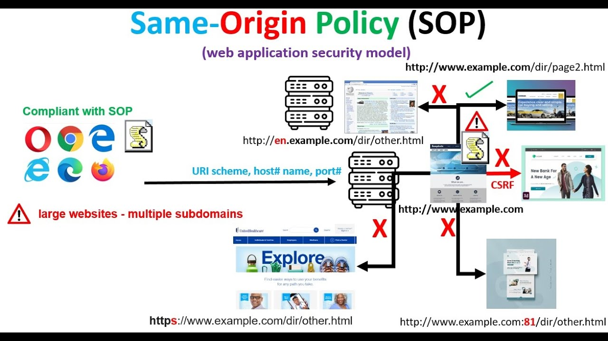
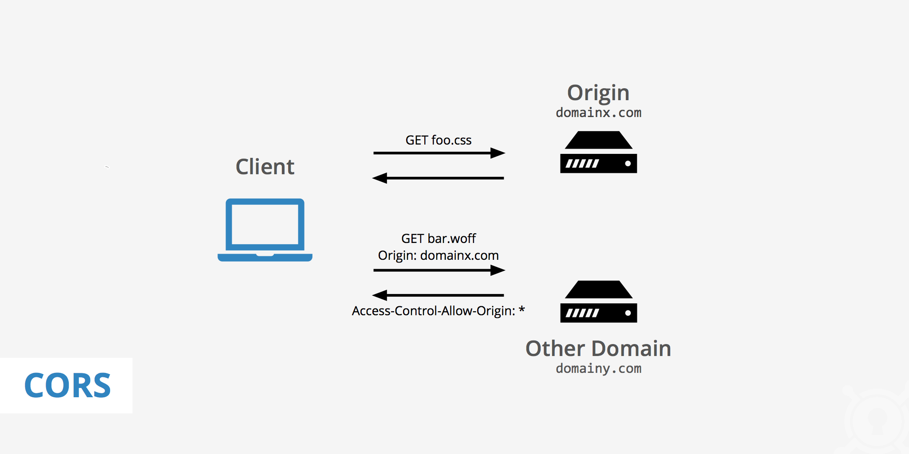

- Origin (This is a tag that indicates where it originated -> Schema, URL, Port) 
- Site (This is a tag that indicates where it goes -> Schema, FQDN, TLD) 
- SOP (Prohibits access to browser information between hosts) 
- CORS (Allows or prohibits access to browser information) 
---
- CSP (Allows or prohibits the execution or loading of site-based scripts) 
- Permissions Policy (Controls access to browser resources -> geolocation, etc.)  
- Sandboxing (Restricts what an embedded resource can do) 
---
- Certificate and HSTS (Enforces HSTS and guarantees identity via TLS) 
- Cookies Security Policies (Protects against CSRF, JS Cookie Theft, etc.) 
--- 

#### Origin 

The origin is defined by the *Schema*, *Hostname* and *Port*, that means if someone of this parameters changed, the origin also will be considered as different.

```python
schema = "http://, ftp://, file://"
hostname = "google.com, x.com, pwn.college"
port = 80, 443, 5050, 445 
```

| **Origin**                         | Cross-Origin? | Why?                                                                                                     |
| ---------------------------------- | ------------- | -------------------------------------------------------------------------------------------------------- |
| http://mywebsite.com:80            | OK            | Has the same schema, hostname and port                                                                   |
| http://mywebsite.com:80/index.html | OK            | The origin only consider the schema, hostname and port and disconsider the path and the referenced file. |
| https://mywebsite.com:80/          | Err           | The schema is different                                                                                  |
| http://website.com:80/             | Err           | The hostname is different                                                                                |
| http://website.com:4444/index.html | Err           | The port is different                                                                                    |

##### Same-Origin and Cross-Origin

**Same-origin**: that's when both sides have the same origin (that's make sense because when a third web site needs to read a cookie for example, it make a request with **Same-Origin**)
**Cross-origin**: that's when both sides have different origins.

Follow the table to be more clear:

| Origins                                            | Type         | Why?                                                            |
| -------------------------------------------------- | ------------ | --------------------------------------------------------------- |
| http://google.com -> http://google.com             | Same-Origin  | Exactly same SCHEMA, HOSTNAME and PORT                          |
| ftp://google.com -> https://google.com             | Cross-Origin | Different schemas                                               |
| https://website.me -> https://website.me:443       | Same-Origin  | Remember that when we access default ports that will be hidden. |
| https://ifconfig.me:443/ -> http://scanme.now:888/ | Cross-Origin | Different SCHEMA, HOSTNAME and PORT.                            |


---
#### Site

This is defined by the *schema* and the *TLDs* to be more precisely the TLD in this context is composed by the FQDN of the host (that are commonly represented by the TLD+1) and also the TLD properly said.

```python
schema = "http://, ftp://, file://"
FQDN = "google, pwn, example"
TLD = ".com, .college, .net"
```

##### Same-Site and Cross-Site

**Same-Site**: That's when both sites have the same URL.
**Cross-Site**: That's when both sites have diferents URLs.

Follow the table to be more clear:

| URL                                       | Type       | Why?                                                                                                                                                 |
| ----------------------------------------- | ---------- | ---------------------------------------------------------------------------------------------------------------------------------------------------- |
| http://google.com -> http://google.com    | Same-Site  | Exactly same SITE.                                                                                                                                   |
| https://google.com -> http://google.com   | Cross-Site | The scheme is different (the FQDN and the TLD also could will be... it will maintain as Cross-site if and only if the next URL doesn't be the same.) |
| ftp://iwantfilescom -> file:///etc/passwd | Cross-Site | Both have completely different schemas and TLDs (TLD+1 or just FQDN and TLD)                                                                         |
| http://nice.one/ -> http://nice.one/      | Same-Site  |                                                                                                                                                      |

---
#### Same-Origin Policy

The **Same-Origin policy** or just **SOP** is a policy that protect the browser to execute some malicious JS on your browser, more common when the context is to make requests out of the origin and also read cookies that doesn't say respect about the origin it self.

for example... let's suppose that we need to access a website... every website have HTML, CSS and also JS... if this request be success we pool all the static stuff from the server to our browser that will be interpreted and executed, the JS coming from the browser could use ```XMLHttpRequest()``` and ```fetch()``` to pull more resources that doesn't say respect of the server that we access... this resource could be malicious for example; SOP prevents from the script pulled from the server to access our cookies we simply doesn't want that a third-party JS read our cookie from our bank.



---
#### CORS

The Cross-Origin Resource Sharing is a policy that makes the SOP more flexible.. otherwise... it's an extension of SOP that uses HTTP headers to define which hosts the origin will could pull data from.

Generally it uses AJAX/XMLHttpServer/fetch functions to pull that kind of remote data when needed.

**Request**
```
GET /sensitive-victim-data HTTP/1.1 
Host: vulnerable-website.com 
Origin: https://malicious-website.com    <- CORS Header
Cookie: sessionid=...
```

**Response**
```
HTTP/1.1 200 OK 
Access-Control-Allow-Origin: https://malicious-website.com 
Access-Control-Allow-Credentials: true
```

This exists because in the end... we need to pull content using Cross-Origin or just pull resources from other hosts including Data from APIs, Images and etc.. **CORS** permits that could be more secure and permissive.

Otherwise, this also prevents that a third-party host that haven't permission to read data from our host.



```http
Access-Control-Allow-Origin: https://mywebsite.com
Access-Control-Allow-Methods: GET, POST
Access-Control-Allow-Headers: Content-Type, Authorization
Access-Control-Allow-Credentials: true
```

---
#### CSP

The **Content Security Policy** or just **CSP** is a policy that prevents common attacks like **XSS, Clickjacking and Insecure-requests** (and much more) by permissive methods also using HTTP headers on **Server Response**, in other words this policy controls which resources could be loaded and executed inside a page.

Different of the **CORS** that just permit or not to read data from a remote (Generally using AJAX/XMLHttpRequest/Fetch) host also using HTTP headers, on **CSP** prevents to execute scripts, load remote images, load frames, traffic without cryptography and etc... that means that prevents XSS, Clickjacking (Same we having the X-Frame-Options), secure trafic, exploitations based on images and much more.

**Some common headers**
```sh
# Header on HTTP
Content-Secure-Policy: parameter1: 'data1'; parameter2: 'data2'

# Parameters:
script-src: 'foo' 
img-src: 'foo'
frame-ancestors: 'foo'


# In practice:
Content-Secure-Policy: script-src: 'self'  <- Same origin
Content-Secure-Policy: script-src: 'none'  <- Nenhuma origin
```

```http
Content-Security-Policy: default-src 'self';
                        script-src 'self' https://cdn.example.com;
                        style-src 'self' 'https://fonts.googleapis.com';
                        font-src 'https://fonts.gstatic.com';
                        img-src 'self' data:;
                        object-src 'none';
                        frame-ancestors 'none';
```

---
#### Permission-Policy

The **Permission-Policy** in a nutshell is a policy that allows or not the front-end access the browser resources like: geolocation, microphone and other resources which the browser support's.

It uses HTTP Headers (as ever) which the programmer could use the programming language on the back-end to define this rules.

```python
#Definition
Permissions-Policy: <feature>=<allowlist>, <feature>=<allowlist>

#Parameters
* -> permits all origins
() -> doesn't permit anything (neither the origin it self could use)
"self" -> only the same-origin
"https://origin.com"  -> only this corigin could use

# --------------------

#How it really is
Permissions-Policy: geolocation=(), microphone="self"

#Wildcard
Permissions-Policy: fullscreen=(self "https://google.com")
# Permits fullscreen exclusively for the origin "https://google.com"
```

---
#### Sandboxing

The concept of a sandbox refers to an idea of an isolated environment, in computing is a way that we executed a program or some other thing in a kind of controlled environment with rules and politics predetermined.

On browser we have a bunch of things that apply this concept, one of them is the ```<iframe>``` tag, this tag means that we will run another website inside our website, and we could attribute a bunch of permissions, including sandboxing it, that's nice because if we didn't trust on the origin, we could load it on our website calmly.

```html
<!-- Will open the google page -->
<iframe src="https://google.com"></iframe> 

<!-- Will open chat.html sandboxed with the permissions to execute scripts and also execute only in same origin -->
<iframe src="chat.html" sandbox="allow-scripts allow-same-origin"></iframe>
```

**Threats:**

- **Ads loaded inside an** ```<iframe>```
- **Untrusted HTML rendering**

---
#### Certificate and HSTS

Defined on the RFC 6797 the **HSTS or Http Strict Transport Security** in nutshell is a policy that you define in your **web server** that forces all clients to use HTTPS with a decent **Certificate**, that's nice because it mitigate **MITM (Man-In-The-Middle)** attacks and also mitigate data sniffing.

About certificates, to understood this concept we need understood the signature concept first.

Signatures is the encrypted data hash using the public key from the recipient, this grant to us reliability and authenticity, now the certificate is the private key from the recipient, which only him can decrypt the hash, and compare with the data hash generated to prove that's authentic.

Based on this concepts when we configure our web server to send the Header ```Strict-Transport-Security``` we definitely need to generate (well saying, buy one) certificate from a certifying entity.

---
#### Cookie Security

The cookies are a small information stored on browser (Client-Side) that's send to the server when requested, usually used to persist logins, persist personal configurations (dark mode for example) and tracks you using Thirty-party cookies.

This resource is really important so we have a bunch of policies that we could implement on... like the follow:

**Secure**: Only will send the cookie if it traffic over the HTTPS
**HttpOnly**: Javascript doesn't have permission to handle this cookie ```document.cookie```
**SameSite**: Controls whether a cookie could be sent using Cross-Site
- *Strict*: Only same-site
- *Lax*: Cookie sent only clicking on link
- *None*: Could be sent all context but must be ```secure```
**Domain & Path**: Restrict where the cookie could be sent
- *Domain=example.com* -> Sent to all subdomains (a.example.com and etc)
- *Path=/account* -> only sent the cookie on requests about */account*
**Expires / Max-Age**: Without this the cookie will be deleted when the browser closes
- *Expires*: Sets an absolute data.
- *Max-age*: Sets a duration (In seconds)


```http
Set-Cookie: sessionid=abc123;
            Secure;
            HttpOnly;
            SameSite=Strict;
            Path=/;
            Domain=example.com;
            Max-Age=3600
```

---
#### Resuming

We have a lot of policies and defenses against more common vulnerabilities the point here, if incorrectly configured or even disabled will leads to this common issues.

The way that we implement this defenses is relative, because have configurations that we need to directly configure on the web server and others we need to set directly on the code when developing.

| Name                                     | Defense Against                                                                                                                                                                            | Code Implementation             | Server Implementation           | HTTP Header                                                                                |
| ---------------------------------------- | ------------------------------------------------------------------------------------------------------------------------------------------------------------------------------------------ | ------------------------------- | ------------------------------- | ------------------------------------------------------------------------------------------ |
| **Same-Origin Policy** (SOP)             | Cross-Origin to extract data from our application                                                                                                                                          | Built-in implemented on Browser | Built-in implemented on Browser | Origin: <host.com>                                                                         |
| **Cross-Origin Resource Sharing** (CORS) | This is an implementation that leads the SOP be more permissive, based on allow and denied hosts.                                                                                          | true                            | true                            | Access-Control-Allow-Origin: <Host><br><br>Access-Control-Allow-Credentials: <true\|false> |
| **Content-Security-Policy** (CSP)        | This is an implementation that prevents against XSS, CSRF and Clickjacking, using HTTP headers with permission based, to load or not specific resources like images, javascript and etc... | true                            | true                            | Content-Security-Policy "default-src 'self'; script-src 'self' https://cdn.mywebsite.com"; |
| **Permission-Policy**                    | This is an implementation that prevents browser unauthorized resource access based on permition.                                                                                           | true                            | true                            | Permissions-Policy "geolocation=(), microphone=(), camera=(self)"                          |
| **Sandboxing**                           | We could sandbox some external content using the tag ```<iframe>``` on our HTML                                                                                                            | true                            | true (Using CSP)                | ```<iframe src="widget.html" sandbox="allow-scripts"></iframe>```                          |
| **Certificate + HSTS**                   | That's an extra layer on HTTPS, that requires to make requests only over HTTPS with a valid certificate (no autosigned)                                                                    | true                            | true                            | Strict-Transport-Security "max-age=31536000; includeSubDomains; preload" always;           |
| Cookie Security Policy                   | This is an implementation to protect our cookies against hijacking and other kind of attack involving them.                                                                                | true                            | true                            | Set-Cookie "sessionid=abc123; HttpOnly; Secure; SameSite=Strict"                           |
